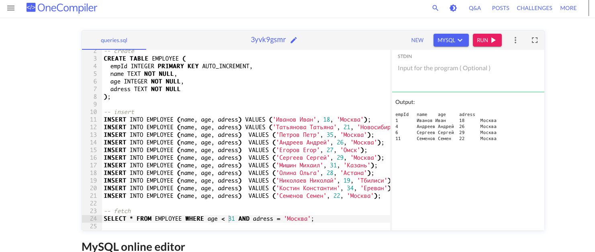

2. Создать файл my.sql, в котором должна создаваться таблица с информацией об одногруппниках. В таблице должно быть четыре поля: id, name, age, address. Все поля в таблице обязательны для заполнения.
   Необходимо добавить 5-10 одногруппников в данную таблицу.
   Необходимо написать запрос на получение имен всех одногруппников (только имен, без всего остального), которые живут в Москве и их возраст находится в диапазоне [18, 30) лет.
   Примечание:
   Квадратные скобки при указании диапазона, означают "включительно", а круглые "не включительно", то есть диапазон (7, 9] означает "от 7, где 7 не попадает в данный диапазон, до 9 включительно". Такой синтаксис нельзя использовать в sql, вам нужно найти решение, как такое условие можно записать в sql по-другому.
   Для проверок работы своего скрипта можете использовать свою базу данных, либо используйте сайт: https://onecompiler.com/mysql

### РЕШЕНИЕ
